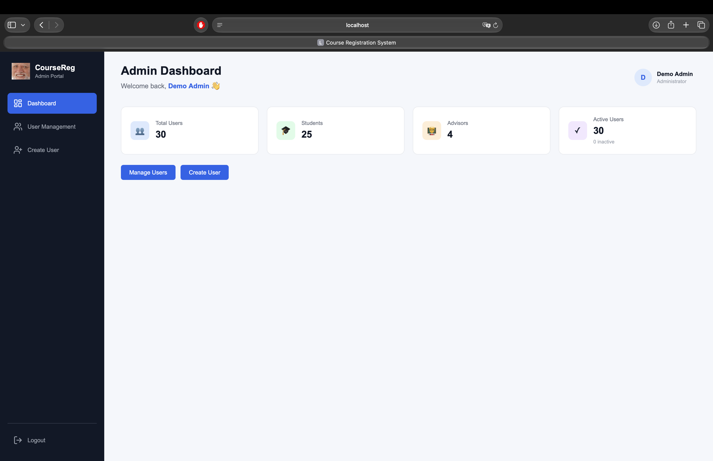
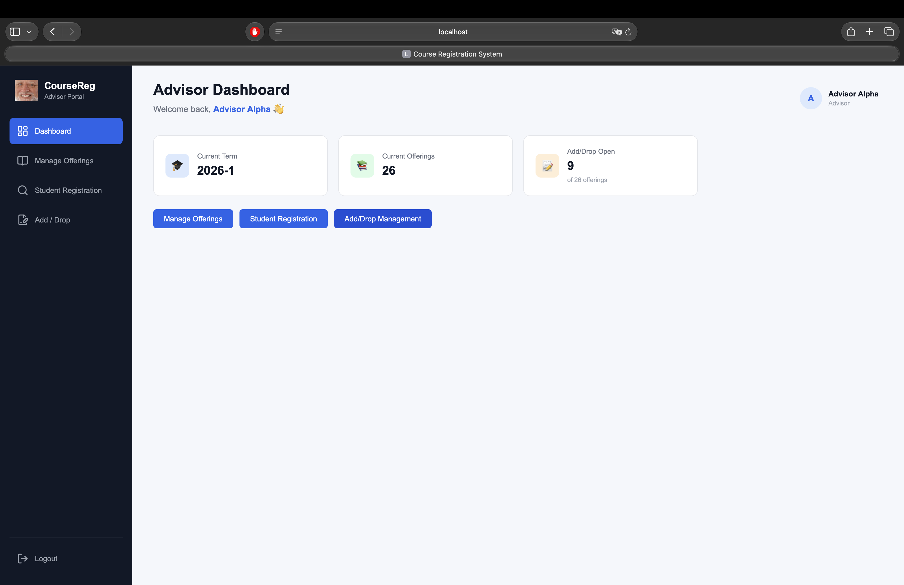
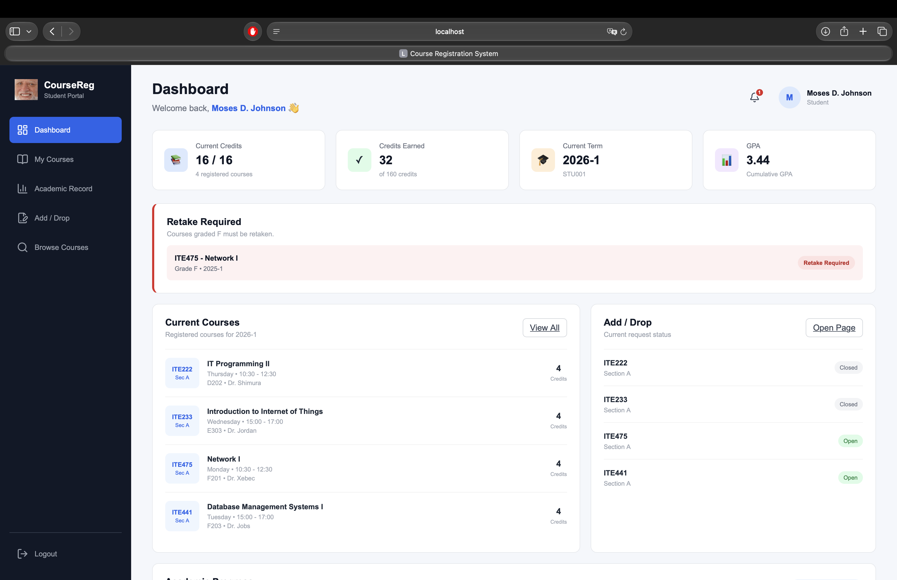
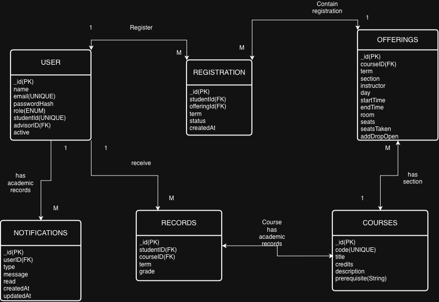

CourseReg — Course Registration System

Course: CSC220 Web Development II
Project: Course Registration System
Technology: MongoDB, Express, React, Node.js (MERN)
Group Number: 4

CourseReg is a full stack university course registration system with three user roles: Admin, Advisor and Student. The system provides role based dashboards, secure authentication, course offering management, student academic records, registration rules, and an add/drop request workflow.

Team Members
Member                      Student ID	                           Role
Sai Lin Phyo	            (2409180001)	            Team Lead / Integrator + Frontend B
Min Khit Oo	               (2409120002)	            Database and Data Lead
Lin Htet	                  (2410010002)	            Backend / API Developer
Snezhana Ochkurova	      (231113014)                Frontend A - Admin and Advisor

Main Responsibilities
- Sai Lin Phyo: repository integration, Git merging/testing, login/shared frontend, Student dashboard and student pages.
- Min Khit Oo: Mongoose schemas, relationships, seed data, database testing and database diagram.
- Lin Htet: Express routes, controllers, authentication, authorization, registration APIs and rules engine integration.
- Snezha: Admin dashboard, User Management, Advisor dashboard, Manage Offerings, Student Registration and Add/Drop management.

## Main Features

Authentication
- One login page for Admin, Advisor and Student.
- Passwords stored as bcrypt hashes.
- JWT authentication.
- Server side role authorization.
- Protected frontend routes.
- Logout available from each dashboard.

### Admin
- Dashboard statistics.
- View and filter users.
- Search by name, email or student ID.
- Create Student, Advisor and Admin accounts.
- Edit user information.
- Deactivate/delete users.
- Reactivate inactive users.
- Prevent an Admin from deleting their own account.
- Prevent the system from being left with zero Admin accounts.

### Advisor
- Advisor dashboard.
- Create course offerings for a selected term.
- View, edit, and delete offerings.
- View course, section, instructor, day/time, room and seat information.
- View live seats taken and seats remaining.
- Open or close Add/Drop for an offering.
- Set an Add/Drop closing date.
- Search/select students.
- View student academic records.
- View eligible courses using the registration rules engine.
- Register students into eligible sections.
- Remove registrations before finalisation.
- Process Add/Drop changes manually.

### Student
- Student dashboard with academic statistics.
- View current registered courses.
- View section, day/time, room, instructor and Add/Drop status.
- View academic records grouped by term.
- View GPA, credits earned, and academic progress.
- Failed courses are marked Retake Required.
- Browse available courses.
- View Add/Drop instructions and closing date.
- Download the official Add/Drop request form.
- View advisor email and required email subject.
- Student notification interface.
Students do not register themselves directly. Registration is handled by an Advisor.

Registration Rules Engine
The eligibility system checks a student's academic record and current registration before allowing a section to be selected.
The system applies these rules:
1. Offered this term
   Only courses with at least one offering in the selected term are considered.
2. Already passed
   A course completed with grade D or higher is blocked from being taken again.
3. Failed course retake
   A course previously graded F is marked Retake Required and prioritised in the eligible course list.
4. Withdrawn course
   A course graded W may be taken again.
5. Seats available
   A section with zero remaining seats is shown as Full and cannot be selected.
6. No time clash
   A section that overlaps another registered/selected course is blocked and the conflicting course is identified.
7. Clear exclusion reasons
   The system shows reasons such as:
   - Already passed - grade B
   - Full — 0 seats remaining
   - Clashes with CSC220 Section 2
   - Not offered this term
Prerequisite checking is supported as an additional project feature when enabled.

Technology Stack
Frontend
- React
- Vite
- React Router
- JavaScript / JSX
- CSS
- Lucide React icons

Backend
- Node.js
- Express
- JWT
- bcrypt / bcryptjs
- CORS
- dotenv

Database
- MongoDB Atlas
- Mongoose

Database Collections
The project uses the following main Mongoose models:
- User
- Course
- Offering
- Registration
- Record
- Notification
The database is populated using the seed script.

Seed Dataset
The seed data includes:
- 25 Students
- 4 Advisors
- 1 Admin
- 18 Courses
- 26 current-term sections
- 312 completed-course records
- Current registrations
- At least one student with an F requiring a retake

The current demonstration term is:
2026-1

Project Structure
Final_Project/
├── client/
│   ├── public/
│   │   ├── AddDropRequest.pdf
|   |   └── university-logo.png
│   ├── src/
│   │   ├── components/
│   │   |   ├── admin/
│   │   |   |   ├── AdminSideBar.jsx
│   │   |   |   ├── UserForm.jsx
│   |   │   |   └── UserTable.jsx
│   │   |   ├── advisor/
│   │   |   |   ├── AdvisorSidebar.jsx
│   │   |   |   ├── EligibleCourseList.jsx
│   │   |   |   ├── OfferingTable.jsx
│   |   │   |   └── StudentSearch.jsx
│   |   |   ├── pages/
│   │   |   |   ├── AcademicRecord.jsx
│   │   |   |   ├── AddDrop.jsx
│   │   |   |   ├── AddDropManagement.jsx
│   │   |   |   ├── AdminDashboard.jsx
│   │   |   |   ├── AdvisorDashboard.jsx
│   │   |   |   ├── BrowseCourses.jsx
│   │   |   |   ├── CreateUser.jsx
│   │   |   |   ├── EditUser.jsx
│   │   |   |   ├── Login.jsx
│   │   |   |   ├── ManageOfferings.jsx
│   │   |   |   ├── MyCourses.jsx
│   │   |   |   ├── StudentDashboard.jsx
│   │   |   |   ├── StudentRegistration.jsx
│   |   │   |   └── UserManagement.jsx
│   |   |   ├── services/
│   |   │   |   └── api.js
│   │   |   ├── ErrorMessage.jsx
│   │   |   ├── Header.jsx
│   │   |   ├── Loading.jsx
│   │   |   ├── ProtectedRoute.jsx
│   │   |   ├── Sidebar.jsx
│   │   |   └── StatCard.jsx
│   |   ├── App.css
│   |   ├── App.jsx
│   |   └── main.jsx
|   ├── index.html
|   ├── package-lock.json
|   └── package.json
│
├── server/
│   ├── config/
│   │   └── db.js
│   ├── controllers/
│   │   ├── addDropNotify.js
│   │   ├── authController.js
│   │   ├── courseController.js
│   │   ├── notificationController.js
│   │   ├── offeringController.js
│   │   ├── registrationController.js
│   │   ├── studentController.js
│   │   ├── studentSearchController.js
|   |   └── userController.js
│   ├── middleware/
│   │   ├── authMiddleware.js
|   |   └── roleMiddleware.js
│   ├── models/
│   │   ├── Course.js
│   │   ├── Notification.js
│   │   ├── Offering.js
│   │   ├── Record.js
│   │   ├── Registration.js
|   |   └── User.js
│   ├── routes/
│   │   ├── authRoutes.js
│   │   ├── courseRoutes.js
│   │   ├── notificationRoutes.js
│   │   ├── offeringRoutes.js
│   │   ├── registrationRoutes.js
│   │   ├── studentRoutes.js
|   |   └── userRoutes.js
│   ├── utils/
│   │   ├── eligibility.js
│   │   └── seed.js
│   ├── .env.example
│   ├── package-lock.json
│   ├── package.json
│   └── server.js
│
├── docs/
│   ├── database-diagram/
│   │   └── Web2ERDiagram.png
│   ├── report/
│   └── screenshots/
│   │   ├── Admin-Dashboard.png
│   │   ├── Advisor-Dashboard.png
│   │   └── Student-Dashboard.png
│
├── .gitignore
└── README.md

Setup Instructions
1. Clone the Repository
git clone https://github.com/CozyHaruk1/Final_Project.git
cd Final_Project

2. Install Backend Dependencies
cd server
npm install

3. Configure Environment Variables
Create a file named:
server/.env
MONGO_URI=
PORT=5001
JWT_SECRET=

4. Seed the Database
From the server directory:
npm run seed
The seed script clears the old project data and loads the required demonstration dataset.

5. Start the Backend
npm run dev
Backend:
http://localhost:5001

6. Install Frontend Dependencies
Open another terminal:
cd client
npm install

7. Start the Frontend
npm run dev
Frontend:
http://localhost:3000
Test Accounts
The following accounts are created by the seed script.
Role	Email	Password
Admin	admin@university.test	    Password123!
Advisor	advisor1@university.test	Password123!
Student	student1@university.test	Password123! (student1 has grade F, student4 has grade W)

These accounts are provided only for project demonstration and testing.
Important API Routes
Examples of the main API endpoints used by the application:

POST   /api/auth/login

GET    /api/users
POST   /api/users
PATCH  /api/users/:id
DELETE /api/users/:id

GET    /api/courses
GET    /api/offerings?term=2026-1
POST   /api/offerings
PATCH  /api/offerings/:id
DELETE /api/offerings/:id

GET    /api/students/:id/record
GET    /api/students/:id/eligible?term=2026-1

POST   /api/registrations
DELETE /api/registrations/:id

GET    /api/me/registrations
GET    /api/me/record

Protected routes require a valid JWT and the correct user role.
Add/Drop Workflow
Add/Drop requests are not automatically approved by the system.

The workflow is:
1. The Advisor opens the Add/Drop window for an offering.
2. The Student sees the Add/Drop status and closing date.
3. The Student downloads the Add/Drop Request form.
4. The Student completes and signs the form.
5. The Student emails the form to their Advisor using the required subject:Add/Drop Request - <Student ID> - <Course Code>
6. The Advisor reviews the request and manually updates the student's registration.
The request form is stored in:
client/public/AddDropRequest.pdf
[Add/Drop Request](client/public/AddDropRequest.pdf)

Screenshots

Admin Dashboard

Advisor Dashboard

Student Dashboard

Feature	                                            Status
Login / JWT authentication	                        Complete
Role-based authorization	                        Complete
MongoDB models and relationships	                  Complete
Seed dataset	                                    Complete
Admin Dashboard	                                 Complete
User Management	                                 Complete
Student Dashboard	                                 Complete
Student Academic Record	                           Complete
Student Add/Drop request flow	                     Complete
Registration rules engine	                        Complete
Advisor Manage Offerings	                        Complete
Advisor Student Registration	                     Complete
Advisor Add/Drop Control	                        Complete
Student notifications	                           Complete
Advisor to student notification integration	      Complete

Testing

The project is tested using:
- Browser-based frontend testing.
- Postman for REST API testing.
- MongoDB Atlas / seed verification for database testing.
- Role based authorization tests.
- Registration rule tests.

Important rule cases tested include:
- Already passed course blocked.
- F grade course marked Retake Required.
- Full section blocked.
- Time clash blocked.
- Withdrawn course allowed to be retaken.
- Invalid/missing authentication rejected.
- Database changes persist after refresh.

Detailed testing screenshots are included in the final project report.

Database Diagram
The final one-page database diagram is stored in:
docs/database-diagram/

It shows the main collections, important fields, references and one to many relationships.

Documentation
Project documentation is stored under:
docs/
├── database-diagram/
├── report/
└── screenshots/

The final group report explains:
- System design decisions.
- Database design.
- Authentication and security.
- Registration rules engine.
- Role-based features.
- Testing and results.
- Problems faced and solutions.
- Division of work.
- AI assistance and verification.
- Conclusion.

Security Notes
- Passwords are stored as hashes, not plain text.
- Authentication uses JWT.
- Protected API routes perform server-side authorization.
- .env is excluded from Git.
- node_modules is excluded from Git.
- Sensitive environment values are not stored in the repository.

Course
Stamford International University
CSC220 — Web Development II
Final Group Project: Course Registration System